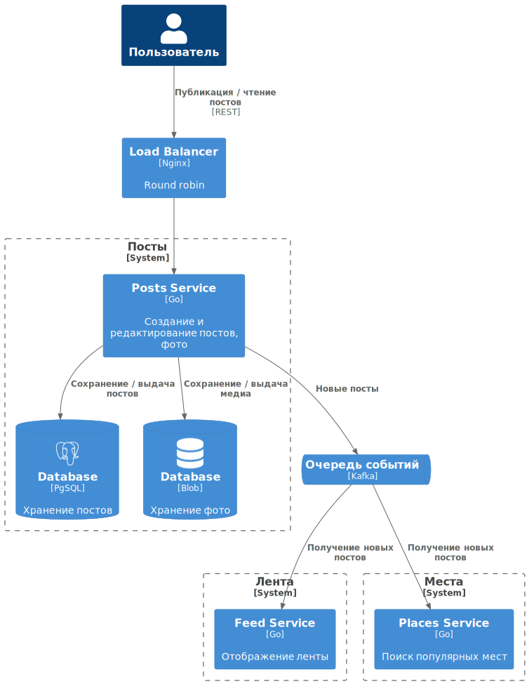
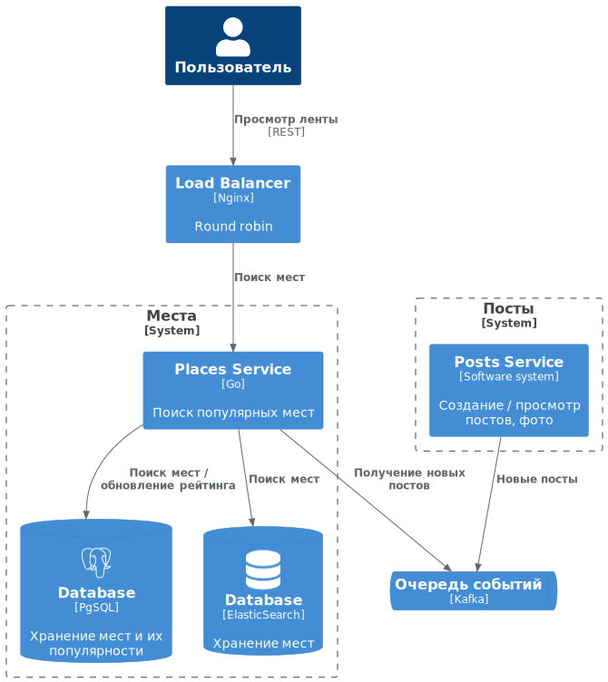

# System Design социальной сети для путешественников
Пример домашней работы по курсу System Design.
Социальная сеть для путешественников эта социальная сеть с прицелом на аудиторию путешественников.
В ней пользователи публикуют фотографии из своих путешествий с привязкой к местам путешествия, обмениваются комментариями.

### Функциональные требования:
- публикация постов из путешествий с фотографиями, небольшим описанием и привязкой к конкретному месту путешествия;
- оценка и комментарии постов других путешественников;
- подписка на других путешественников, чтобы следить за их активностью;
- поиск популярных мест для путешествий и просмотр постов с этих мест;
- просмотр ленты других путешественников;
- только для стран СНГ;

### Нефункциональные требования:
- 10 000 000 DAU
- Доступность (availability) 99.95%
- Данные храним всегда
- Один пользователь в среднем будет делать 5 запросов в день
- В рамках одного поста можно прикрепить не более 5 фотографий
- Пользователь в среднем будет делать 1 пост в неделю
- Пользователь в среднем будет оставлять 2 комментария в день
- Максимальный размер фото 1мб, если больше то сжимается
- В среднем будет 1 фото в одном посте
- В ленте 1 фото с каждого аккаунта, на которых подписан путешественник
- Максимум 10 000 000 подписчиков на одного пользователя
- Не более 2000 символов в описании поста
- Сезонности нет
- Тайминги:
    - Отображение ленты не более 1 сек
    - Поиск мест не более 3 сек
 
## Design overview

Для описания системы используется [C4 model](https://c4model.com/).

<p align="center">
    </br><b>Level 1.</b> System context diagram</br></br>
</p>

<p align="center">
  
</p>

<p align="center">
    </br><b>Level 2.</b> Диаграмма системы Постов</br></br>
</p>

<p align="center">
  
</p>

<p align="center">
    </br><b>Level 2.</b> Диаграмма системы Лента</br></br>
</p>

<p align="center">
  
</p>

<p align="center">
    </br><b>Level 2.</b> Диаграмма системы Места</br></br>
</p>

<p align="center">
  
</p>

<p align="center">
    </br><b>Level 2.</b> Диаграмма системы Комментарии</br></br>
</p>

<p align="center">
  
</p>

### Базовые расчеты нагрузки:
RPS (публикация поста)
```
DAU = 10 000 000
1 пост в неделю
RPS = 10 000 000 / 86 400 / 7 ~= 17
```

RPS (комментарии)
```
DAU = 10 000 000
2 комментария в день
RPS = 10 000 000 / 86 400 * 2 ~= 235
```

RPS (просмотр ленты)
```
DAU = 10 000 000
5 запросов в день
RPS = 10 000 000 / 86 400 * 5 ~= 575
```

Траффик (публикация поста)
```
Размер фото 1 МБ
Размер комментария ~ 500 байт
Мета информация ~ 40 байт
Traffic медиа = 17 * 1024kb ~= 17 MB/s
Traffic комментариев = 17 * 540b ~= 9 KB/s
```

Траффик (комментарии)
```
Размер комментария ~ 150 байт
Write Traffic = 235 * 150 ~= 35 KB/s
Read Traffic = 575 * 150 ~= 85 KB/s
```

Траффик (Просмотр ленты)
```
Размер ленты фото (превью самих фото) ~ 500 KB
Размер комментария ~ 500 байт
Мета информация ~ 40 байт
Traffic медиа = 575 * 0.5 MB ~= 288 MB/s
Traffic комментария = 575 * 540b ~= 310 KB/s
```

### Базовые расчеты железа:
#### Расчёт дисков
Посты (без учета фото)
```
Capacity: 9 KB/s * 86400 * 365 ~= 300 GB
IOPS: 575 + 17 ~= 600
Throughput: 9 KB/s (write) + 310 KB/s (read) ~= 320 KB/s

SSD:
Disks_for_capacity = 300 GB / 500 GB = 1
Disks_for_throughput = 320 KB/s / 500 MB/s = 1
Disks_for_iops = 600 / 1000 = 1
Disks = max(1,1,1) = 1
```

Посты (фото)
```
Capacity: 17 MB/s * 86400 * 365 ~= 512 TB
IOPS: 575 + 17 ~= 600
Throughput: 17 MB/s (write) + 288 MB/s (read) ~= 310 MB/s

SSD:
Disks_for_capacity = 512 TB / 100 TB = 5.1
Disks_for_throughput = 310 MB/s / 500 MB/s = 0.7
Disks_for_iops = 600 / 1000 = 0.6
Disks = ceil(max(5.1,0.7,0.6)) = 6
```

Комментарии
```
Capacity: 35 KB/s * 86400 * 365 ~= 1 TB
IOPS: 235 + 575 ~= 810
Throughput: 35 KB/s (write) + 85 KB/s (read) ~= 120 KB/s

SSD:
Disks_for_capacity = 1 TB / 1 TB = 1
Disks_for_throughput = 120 KB/s / 500 MB/s = 1
Disks_for_iops = 810 / 1000 = 0.8
Disks = ceil(max(1,1,0.8)) = 1
```

### Хранение данных и кол-во хостов:
#### Посты

- Вид репликации: master-slave (async) 
- Фактор: 3
- Кол-во хостов (disks / disks_per_host): 1 / 1 = 1
- Хостов с учетом репликации: 1 * 3 = 3
- Шардирование: нет

Вариант async выбран, т.к. задержка отображения нового поста у подписичиков не критична.  
Шардирование не используем, т.к. у нас в основном нагрузка на IOPS и чтение, которые держит 1 хост, а возможные скочки с запасом компенсируют реплики

#### Комментарии

- Вид репликации: master-slave (async)
- Фактор: 3
- Шардирование: да, по post_id. Кол-во шардов (физических): 2
- Кол-во хостов (disks / disks_per_host): 1 / 1 = 1
- Хостов с учетом репликации: 1 * 3 = 3
- Хостов с учетом репликации и шардирования: 3 * 2 = 6

Вариант async выбран, т.к. задержка отображения комментариев не критична.  
Шардирование делаем на 2 сервера, т.к. IOPS уже на границе диска

#### Фото (медиа)

- Вид репликации: master-slave (async)
- Фактор: 3
- Шардирование: да, по post_id
- Кол-во хостов (disks / disks_per_host): 6 / 1 = 6
- Хостов с учетом репликации: 3 * 3 = 18

Вариант async выбран, т.к. задержка отображения фото не критична.
